+++
date = '2026-04-19T20:15:00-04:00'
draft = false
title = 'Automated ETL Pipeline for Onchain Analysis'
categories = ['Data']
+++

Onchain analysis is constrained by SQL and data plumbing. Researchers end up spending too much time writing queries and moving data between Dune and external APIs.

At Blocmates, we solved this with an [agent-driven ETL pipeline](https://github.com/DeFi-Kai/dune-etl-agent) that automates dashboard production for the research team.

You fill out a data spec, the agent writes, tests, and pushes queries to Dune using GitHub for version control. If the spec involves heavy API usage, the agent sets up a GitHub Action to collect data and load it into Dune. Queries are generated in minutes and are then ready for visualization in Dune's UI.

We used this workflow to produce dashboards for [MetaDAO's ICO metrics](https://dune.com/blocmates_research/metadao-blocmates-pro) and [Chain GDP](https://dune.com/blocmatesresearch/chain-gdp), a valuation framework for L1 blockchains.


*MetaDAO ICO dashboard*


*Chain GDP dashboard*

Here's how it works.

## Dune ETL agent

The data spec is the single entry point. The user fills out the target blockchain(s), API source(s), and a numbered list of visualizations with short descriptions. They then invoke `/run-spec <path>` (or paste the spec inline) to kick off the run.

On each run, the agent (via Claude Code) loads a DuneSQL best practices skill covering query structure, optimization, and error handling. Depending on the spec, the agent can also load two additional skills:

1. API references skill: shared techniques for Dune LiveFetch (`http_get`, `http_post`, JSON parsing, and error handling). It points to per-API leaves such as `api-defillama` for endpoints, auth, and rate limits.
2. Chain references skill: shared techniques for querying chain tables on Dune. It points to per-chain leaves (`chain-solana`, `chain-ethereum`, and others) with table lists, partition windows, and chain-specific quirks.

Skills are separated this way to avoid context bloat. Documentation is required for each unique data source, but loading every source on every run would be expensive and unreliable. Skill files are only loaded when the spec declares a matching chain or API.



If the spec includes onchain data, the agent loads the chain references skill plus the chain leaf (for example, `chain-solana` or `chain-ethereum`). The leaf contains recommended tables, schema notes, and chain-specific guidance.

When the spec includes external sources, the agent loads API references plus the matching API leaf (for example, `api-defillama`) for endpoints, auth, and rate limits.

The starter ships with `chain-solana` and `api-defillama` as worked examples and templates for adding new chains or APIs.

```markdown
---
project: solana-defi-health
chains: [solana]
apis: [defillama]
refresh: daily 06:00 UTC
---

## Visualizations

1. **Solana DEX volume, last 30 days.** Daily stacked area, split by protocol. Add a 7-day rolling mean. Mark 2026-03-15 as "Jupiter v6 launch".

2. **Stablecoin net flow onto Solana.** Weekly bars for the last 12 weeks, USDC + USDT combined. Green for inflow, red for outflow.

3. **Top 10 Solana wallets by DEX volume (30d).** Simple table, sortable by volume.
```

_Example data spec._

## Handling API limits

By default, APIs are called inline through LiveFetch. But Dune enforces limits: 5-second timeout per request, 4 MB response size, and 80 requests per second per proxy.

When the agent hits a data limit error (for example, HTTP 429), it asks the user to approve creating a new data source. If approved, it creates a Python script (triggered by GitHub Actions) to fetch JSON directly from the API, save a CSV in the repo, and load it as a dataset on Dune.

## Verification and iteration

Each query is processed through `verify.py`, which runs static lint checks and a dry run against Dune. If a query fails, the agent revisits the best-practices error-handling guidance and retries, with a cap of two revisions per query. On the third failure, it stops and surfaces the error.

Once queries are created successfully, the user validates outputs in Dune's UI and configures visualizations there. Additional edits can be prompted by referencing a query ID.

## Publishing workflow

To close the loop, the agent runs `pull_from_dune.py` to capture any UI edits (or no-op if unchanged), commits the synced state, and opens a PR.

You or team members can merge the PR.
