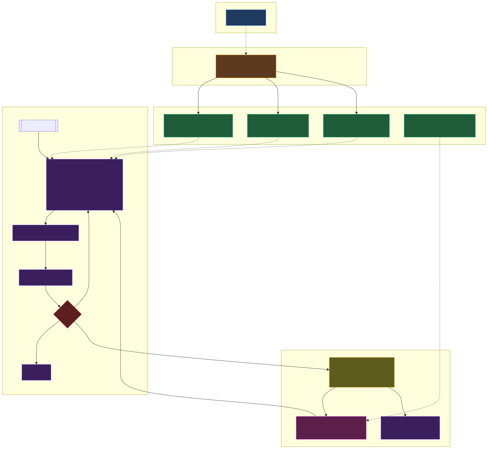

+++
date = '2026-04-19T20:15:00-04:00'
draft = false
title = 'Building an Agentic Pipeline for Onchain Analytics'
slug = 'building-an-agentic-pipeline-for-onchain-analytics'
aliases = ['/data/automated-etl-pipeline-for-onchain-analysis/']
categories = ['Data']
+++

Building a dataset can take longer than writing the actual report. An analyst might have to query raw onchain data, call external APIs, and join these sources to create the required dataset. And all of this can take up to weeks before you even begin writing. 

We wanted to go from idea to final report as fast as possible at Blocmates, so we created an [agentic pipeline](https://github.com/DeFi-Kai/dune-etl-agent) for onchain data analysis. You fill out a data spec and the agent fetches data from external APIs, writes SQL queries, tests them, and pushes the files to Dune using GitHub for version control. 

[MetaDAO’s ICO dashboard](https://dune.com/blocmates_research/metadao-blocmates-pro) and [Chain GDP](https://dune.com/blocmatesresearch/chain-gdp) were both created using this workflow.


*MetaDAO ICO dashboard*


*Chain GDP dashboard*

Here's how it works.

## How it works

Dune provides access to raw onchain data and acts as the query and visualization layer. It offers an API and an MCP server that let you create and update queries programmatically. The MCP server is designed to work directly with Claude and other LLMs but in our experience, the MCP used ~2x as many Dune credits as the API for the same tasks. 

MCPs often increase the chances of an LLM misinterpreting instructions because they expose a large tool surface directly to the model. If the prompt is not precise the model may call more tools than necessary to complete the task. In contrast, when you use the API, you get to specify which endpoints to call but it comes at the cost of architectural overhead. We opted for the API because of its cost-efficiency and with the correct markdown files it could lead to a more deterministic process. 

The harness is made up of markdown files that provide instructions, references and domain knowledge, and inform the agent what to do and when to do things. Certain skills reference Python scripts for verification and API calls. 



We begin each run by filling out a data spec with the target blockchain(s), API source(s), and a numbered list of visualizations with short descriptions. They then invoke `/run-spec <path>` (or paste the spec inline) to kick off the run.

On each run, the agent (via Claude Code) loads a DuneSQL best practices skill covering query structure, optimization, and error handling. Depending on the spec, the agent can also load two additional skills:

1. API references skill: shared techniques for Dune LiveFetch (`http_get`, `http_post`, JSON parsing, and error handling). It points to per-API leaves such as `api-defillama` for endpoints, auth, and rate limits.
2. Chain references skill: shared techniques for querying chain tables on Dune. It points to per-chain leaves (`chain-solana`, `chain-ethereum`, and others) with table lists, partition windows, and chain-specific quirks.

Skills are separated this way to avoid context bloat. Documentation is required for each unique data source, but loading every source on every run would be expensive and unreliable. Skill files are only loaded when the spec declares a matching chain or API.

If the spec includes onchain data, the agent loads the chain references skill plus the chain leaf (for example, `chain-solana` or `chain-ethereum`). The leaf contains recommended tables, schema notes, and chain-specific guidance.

When the spec includes external sources, the agent loads API references plus the matching API leaf (for example, `api-defillama`) for endpoints, auth, and rate limits.

The starter ships with `chain-solana` and `api-defillama` as worked examples and templates for adding new chains or APIs.

```markdown
---
project: solana-defi-health
chains: [solana]
apis: [defillama]
refresh: daily 06:00 UTC
---

## Visualizations

1. **Solana DEX volume, last 30 days.** Daily stacked area, split by protocol. Add a 7-day rolling mean. Mark 2026-03-15 as "Jupiter v6 launch".

2. **Stablecoin net flow onto Solana.** Weekly bars for the last 12 weeks, USDC + USDT combined. Green for inflow, red for outflow.

3. **Top 10 Solana wallets by DEX volume (30d).** Simple table, sortable by volume.
```

_Example data spec._

Each query is processed through `verify.py`, which runs static lint checks and a dry run against Dune. If a query fails, the agent revisits the best-practices error-handling guidance and retries, with a cap of two revisions per query. On the third failure, it stops and surfaces the error.

Each dashboard is assigned a yaml file that lists queries with a unique ID and link to the live query on Dune. If you start a new session and want to make an edit you can reference the URL, ID, or the dashboard name so the agent can identify which query to access. 

After the query is created, we manually configure the visualizations in Dune's UI. We perform row-level spot checks, and check math by hand to validate the datas correctness. When live sources exist, we check directly against them. 

## Handling API limits

By default, APIs are called inline through LiveFetch. But Dune enforces limits: 5-second timeout per request, 4 MB response size, and 80 requests per second per proxy.

When the agent hits a data limit error (for example, HTTP 429), it asks the user to approve creating a new data source. If approved, it creates a Python script (triggered by GitHub Actions) to fetch JSON directly from the API, save a CSV in the repo, and load it as a dataset on Dune.


## Publishing workflow

To close the loop, the agent runs `pull_from_dune.py` to capture any UI edits (or no-op if unchanged), commits the synced state, and opens a PR.

You or team members can merge the PR.
