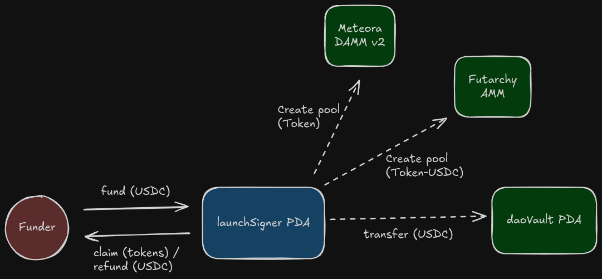
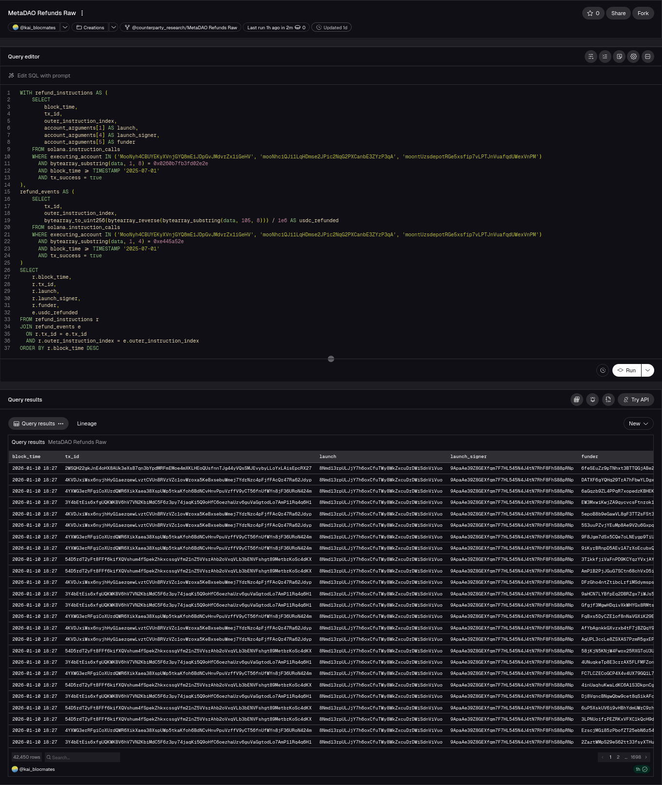

+++
date = '2026-01-24T09:00:00-05:00'
draft = false
title = 'MetaDAO Launchpad Query Notes (Dune/ TrinoSQL)'
+++



While building the [MetaDAO dashboard](https://dune.com/blocmates_research/metadao-blocmates-pro) at Blocmates, [@563defi](https://x.com/563defi) and I spent some time digging into MetaDAO's launchpad program to understand the existing Dune queries, build on them, and create new ones.

These are my notes, which I will be referring back to as I verify & build out more queries on MetaDAO's activity. This can also be used as context to feed to an LLM for generating simple queries.

Hopefully this helps you understand the program structure and verify your queries are pulling the right data.
## Overview
MetaDAO uses the launchpad program to run token presales. Users commit USDC, and after the raise closes, they claim their token allocation (plus refunds if oversubscribed). If the raise is successful, the program creates two liquidity pools, and transfers the remaining USDC to the project's treasury. 
### Instructions Covered
The `launchpad_v7` program contains nine instructions, but this document will only cover the following instructions:

| Instruction        | Description                                                                                           |
| ------------------ | ----------------------------------------------------------------------------------------------------- |
| `initializeLaunch` | Stages the launch onchain, minting token, and creating the necessary accounts for state and transfers |
| `fund`             | User commits USDC to a raise                                                                          |
| `CompleteLaunch`   | Authority closes raise, triggers AMM pool creation and treasury funding                               |
| `claim`            | User receives token allocation                                                                        |
| `refund`           | User claims refund                                                                                    |


When a launch is initiated, the program creates the necessary accounts for state management and transfers. You should pay special attention to two of these accounts: `launchSigner` and `launch`. 

The `launchSigner` account serves as the authority for fund commitments, claims, and refunds throughout the sale.


Meanwhile, the `launch` account stores configuration and state, tracking details like `totalCommittedAmount`, and `secondsForLaunch`. **More importantly, the launch account appears at position 1 in every instruction, making it the key filter for querying a specific raise.**

### Program IDs

| Version | Program ID                                    |
| ------- | --------------------------------------------- |
| v0.7.0  | `moontUzsdepotRGe5xsfip7vLPTJnVuafqdUWexVnPM` |
| v0.6.0  | `MooNyh4CBUYEKyXVnjGYQ8mEiJDpGvJMdvrZx1iGeHV` |
| v0.5.0  | `mooNhciQJi1LqHDmse2JPic2NqG2PXCanbE3ZYzP3qA` |

*v5, v6, and v7 share the same instruction structure and all queries in this doc work across versions by including each program ID in your filter. However, the event data emitted on-chain differs slightly between versions and isn't covered here.*

### How Queries Work
Each instruction in the launchpad program can be identified using Dune's `solana.instruction_calls` table by filtering on:
1. **Program ID** (`executing_account`) - the launchpad program address(es)
2. **8-byte discriminator** - the first 8 bytes of the instruction data, unique to each instruction type 
3. **Account arguments** - accounts at specific positions identify the launch, funder, and other relevant addresses

## Instruction Breakdown

### initializeLaunch

The `initializeLaunch` instruction stages the launch onchain by minting the token and creating the necessary accounts for state management and transfers.

#### Discriminator:

| Bytes | Value              |
| ----- | ------------------ |
| 1-8   | `5ac9dc8e70fd640d` |

```SQL
WHERE bytearray_substring(data, 1, 8) = 0x5ac9dc8e70fd640d
```

#### Account Positions:

| Position | Account       | SQL                    | Description                                |
| -------- | ------------- | ---------------------- | ------------------------------------------ |
| 1        | launch        | `account_arguments[1]` | PDA storing launch configuration and state |
| 2        | Base Mint     | `account_arguments[2]` | Mint address of the token being sold       |
| 4        | launch Signer | `account_arguments[4]` | Authority wallet for fund transfers        |


#### Instruction Data:

| Value                         | Bytes   | Type                | Description                                            |
| ----------------------------- | ------- | ------------------- | ------------------------------------------------------ |
| minimumRaiseAmount            | 9-16    | u64 (little-endian) | Minimum USDC that must be raised for launch to succeed |
| monthlySpendingLimitAmount    | 17-24   | u64 (little-endian) | Maximum USDC the treasury can spend per month          |
| performancePackageTokenAmount | 224-231 | u64 (little-endian) | Token allocation reserved for performance incentives   |
| monthsUntilInsidersCanUnlock  | 232     | u8                  | Lockup period before insiders can access tokens        |

*Decoded*: 

```SQL

-- minimumRaiseAmount (bytes 9-16, u64)
bytearray_to_uint256(bytearray_reverse(bytearray_substring(data, 9, 8))) / 1e6 AS minimum_raise_amount

-- monthlySpendingLimitAmount (bytes 17-24, u64)
bytearray_to_uint256(bytearray_reverse(bytearray_substring(data, 17, 8))) / 1e6 AS monthly_spending_limit

-- performancePackageTokenAmount (bytes 224-231, u64)
bytearray_to_uint256(bytearray_reverse(bytearray_substring(data, 224, 8))) / 1e6 AS performance_package_token_amount

-- monthsUntilInsidersCanUnlock (byte 232, u8 - single byte, no reverse needed)
bytearray_to_uint256(bytearray_substring(data, 232, 1)) AS months_until_insiders_can_unlock

```

**Example:**
https://solscan.io/tx/2fbjgAiRnGShdmtkEc6UTA3EzXsuSk7omtu499F9vPE3M8rEo9ux6HHN7CriXTN554wpnU2aHpxedJTLcq6VQJWQ
https://solscan.io/tx/3WsHz8iCgeq4VLapPtJGyyccSiPPpc4BYRc4g5GKNQAnEVzRGu1hjuwR4ujBbBXLQLtx3aEW4vzrnuhXxy1S2pPs

### Fund 
When a user commits USDC to a raise, they call the `fund` instruction.
#### Discriminator:

| Bytes | Value              |
| ----- | ------------------ |
| 1-8   | `dabc6fdd9871ae07` |

```SQL
WHERE bytearray_substring(data, 1, 8) = 0xdabc6fdd9871ae07
```

#### Account Positions:

| Position | Account      | SQL                    | Description                                 |
| -------- | ------------ | ---------------------- | ------------------------------------------- |
| 1        | launch       | `account_arguments[1]` | PDA storing launch configuration and state  |
| 3        | launchSigner | `account_arguments[3]` | Authority wallet for fund transfers         |
| 5        | funder       | `account_arguments[5]` | Wallet address of the user committing funds |

#### Instruction Data:

| Value  | Bytes | Type                | Description                       |
| ------ | ----- | ------------------- | --------------------------------- |
| amount | 9-16  | u64 (little-endian) | USDC amount committed by the user |


*Decoded*: 
```SQL
bytearray_to_uint256(bytearray_reverse(bytearray_substring(data, 9, 8))) / 1e6 AS usdc_amount
```

**Example:**
[Transaction Ty9tEwqASApmCLWodJkkoS5bEREp9VggTniVqGU4X769tvSHth6165qPzSD3xcg2HJSzercLS2vYAAuLbMhByoo](https://solscan.io/tx/Ty9tEwqASApmCLWodJkkoS5bEREp9VggTniVqGU4X769tvSHth6165qPzSD3xcg2HJSzercLS2vYAAuLbMhByoo)
### Complete Launch
Once a raise succeeds, the `completeLaunch` instruction signals the conclusion of a raise, creates liquidity pools on Futarchy AMM and Meteora DAMM v2, and seeds the project's treasury (Squads Multisig Vault).
#### Discriminator:

| Bytes | Value              |
| ----- | ------------------ |
| 1-8   | `76cffa822c94fbed` |

```SQL
WHERE bytearray_substring(data, 1, 8) = 0x76cffa822c94fbed
```

#### Account Positions:

| Position | Account                                      | SQL                     | Description                                |
| -------- | -------------------------------------------- | ----------------------- | ------------------------------------------ |
| 1        | launch                                       | `account_arguments[1]`  | PDA storing launch configuration and state |
| 5        | launchSigner                                 | `account_arguments[5]`  | Authority wallet for fund transfers        |
| 14       | Dao (Futarchy AMM pool)                      | `account_arguments[14]` | Futarchy AMM liquidity pool (Token-USDC)   |
| 16       | Squads Multisig Vault                        | `account_arguments[16]` | Project treasury controlled by the DAO     |
| 36       | Meteora Accounts Pool (Meteora DAMM v2 pool) | `account_arguments[36]` | Meteora DAMM v2 liquidity pool (Token)     |

### Claim
When a raise completes, the `claim` instruction is triggered to send tokens to participants' wallets.
#### Discriminator:

| Bytes | Value              |
| ----- | ------------------ |
| 1-8   | `3ec6d6c1d59f6cd2` |

```SQL
WHERE bytearray_substring(data, 1, 8) = 0x3ec6d6c1d59f6cd2
```

#### Account Positions:

| Position | Account      | SQL                    | Description                                |
| -------- | ------------ | ---------------------- | ------------------------------------------ |
| 1        | launch       | `account_arguments[1]` | PDA storing launch configuration and state |
| 3        | launchSigner | `account_arguments[3]` | Authority wallet for fund transfers        |
| 6        | funder       | `account_arguments[6]` | Wallet address of the user claiming funds  |

#### Instruction Data:

The claim value is located in the second inner instruction's data payload. You can filter these inner instructions using their 8-byte discriminator. 


**Discriminator for claim inner instruction:**

| Bytes | Value              |
| ----- | ------------------ |
| 1-8   | `e445a52e51cb9a1d` |


**Claimed token amount:**

| Value         | Bytes   | Type                | Description          |
| ------------- | ------- | ------------------- | -------------------- |
| tokensClaimed | 105-112 | u64 (little-endian) | Claimed token amount |


*Decoded*: 

To query claim instructions, create two CTEs:
1. Capture claim instructions by filtering on discriminator `3ec6d6c1d59f6cd2`
2. Capture inner instructions containing the token amount by filtering on discriminator `e445a52e51cb9a1d`

Join on `tx_id` and `outer_instruction_index` to match events to their parent instructions.

Here's an example forked from [@adam_tehc](https://dune.com/adam_tehc):




https://dune.com/queries/6529959?sidebar=none


**Example:**
[Transaction 2aFDEAGW8gRTFBks8pf56ENibg4HQbSYev4enw4rqcaHUiDMLV4SL3REPFK4zYiLRQngCLKsYXvRSzdQvChSqTYG](https://solscan.io/tx/2aFDEAGW8gRTFBks8pf56ENibg4HQbSYev4enw4rqcaHUiDMLV4SL3REPFK4zYiLRQngCLKsYXvRSzdQvChSqTYG)

### Refund
When a raise is oversubscribed, the `refund` instruction returns excess USDC to participants.
#### Discriminator:

| Bytes | Value              |
| ----- | ------------------ |
| 1-8   | `0260b7fb3fd02e2e` |

```SQL
WHERE bytearray_substring(data, 1, 8) = 0x0260b7fb3fd02e2e
```

#### Account Positions:

| Position | Account      | SQL                    | Description                                |
| -------- | ------------ | ---------------------- | ------------------------------------------ |
| 1        | launch       | `account_arguments[1]` | PDA storing launch configuration and state |
| 4        | launchSigner | `account_arguments[4]` | Authority wallet for fund transfers        |
| 5        | funder       | `account_arguments[5]` | Wallet address of the user                 |

#### Instruction Data:

The refunded value is located in the second inner instruction's data payload. You can filter these inner instructions using the data's 8-byte discriminator. 


**Discriminator for inner instruction:**

| Bytes | Value              |
| ----- | ------------------ |
| 1-8   | `e445a52e51cb9a1d` |

**Refunded USDC value:**

| Value        | Bytes   | Type                | Description |
| ------------ | ------- | ------------------- | ----------- |
| usdcRefunded | 105-112 | u64 (little-endian) | USDC amount |

*Decoded*: 

To query refund instructions, create two CTEs:
1. Capture refund instructions by filtering on discriminator `0260b7fb3fd02e2e`
2. Capture inner instructions containing the token amount by filtering on discriminator `e445a52e51cb9a1d`

Join on `tx_id` and `outer_instruction_index` to match events to their parent instructions.

**Example:**
[Transaction zwtWBrKobmdpY5ZPW5vdLyd2KFByyipYdij8jtB8g8V7CgTXzq5DQBExbqujQQhd8vCrBJmvMDyja5NaR9naxuH](https://solscan.io/tx/zwtWBrKobmdpY5ZPW5vdLyd2KFByyipYdij8jtB8g8V7CgTXzq5DQBExbqujQQhd8vCrBJmvMDyja5NaR9naxuH)

[Transaction zdrYEdQQrP2C8XDGkY8M9LgNLLUX54yFJGWVoMPaxWMYJBN5tRrDagDzaF6ZdP7raYmLjm7N5i8Nug9VamVwbnR](https://solscan.io/tx/zdrYEdQQrP2C8XDGkY8M9LgNLLUX54yFJGWVoMPaxWMYJBN5tRrDagDzaF6ZdP7raYmLjm7N5i8Nug9VamVwbnR)
